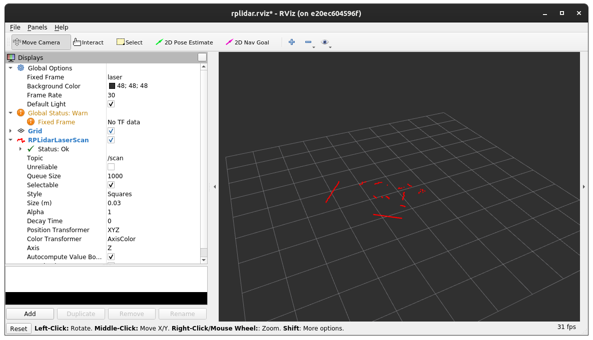
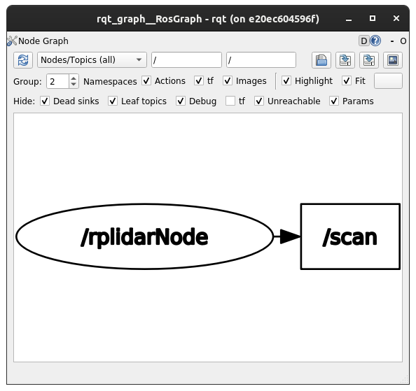
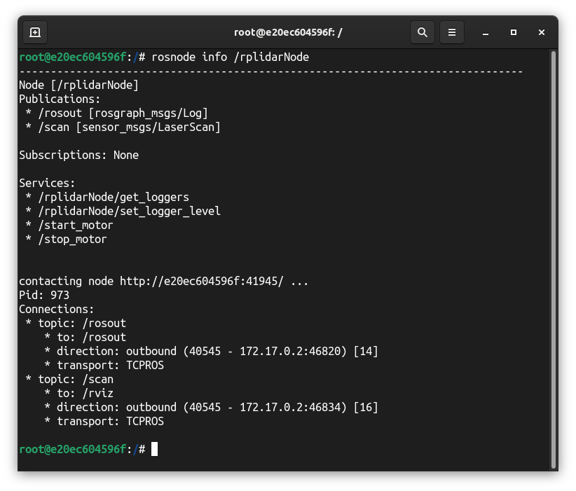
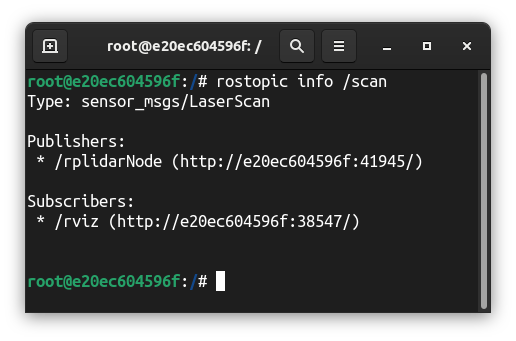
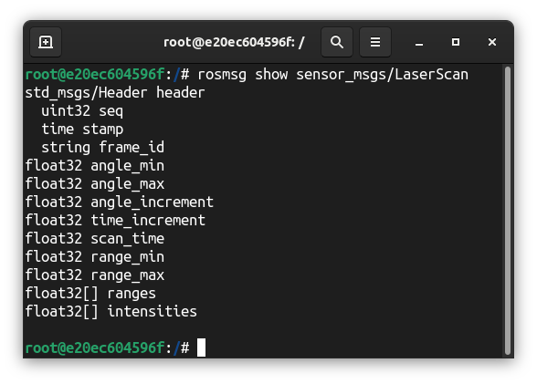

# RPLIDAR

*Ce répertoire sert de documentation pour le RPLidar. Il relatera des diffrents tests effectués avec le capteur.*

## Installation

Nous avons testé le lidar sur ROS en suivant les instructions suivantes : [rpilidar_ros](https://github.com/slamtec/rplidar_ros).

*Noter que suivre ces instructions nécessite l'installation de [ROS](http://wiki.ros.org/noetic/Installation).*

*Il est également possible d'installer ROS en passant par Docker: [tutoriel](https://github.com/allantarcy/ros_gui_with_docker).*

Vous pouvez utiliser les instructions suivantes pour installer ros avec Docker:

```sh
sudo docker run -it \
    --privileged \
    --name=ros_noetic \
    --user=$(id -u $USER):$(id -g $USER) \
    --env="DISPLAY" \
    --env="QT_X11_NO_MITSHM=1" \
    --env="LIBGL_ALWAYS_SOFTWARE=1" \
    --volume="/etc/group:/etc/group:ro" \
    --volume="/etc/passwd:/etc/passwd:ro" \
    --volume="/etc/shadow:/etc/shadow:ro" \
    --volume="/etc/sudoers.d:/etc/sudoers.d:ro" \
    --volume="/tmp/.X11-unix:/tmp/.X11-unix:rw" \
    -u root \
    osrf/ros:noetic-desktop-full \
    bash
```

## Tests

Pour tester le lidar, Slamtec met a disposition un package ROS et les instructions associées pour tester le lidar: [lien](https://github.com/Slamtec/rplidar_ros/tree/master).

### Compiler la librairie

La marche à suivre pour faire tourner les exemples est la suivante:

> 1\) Clone this project to your catkin's workspace src folder

Créer un workspace catkin si ce n'est pas déjà fait, par exemple:

```sh
mkdir -p ~/workspace/src
cd ~/workspace
catkin_make
```

Cloner le répertoire github

```sh
#Dans le dossier ~/workspace/src
git clone https://github.com/slamtec/rplidar_ros.git
```

> 2\) Running catkin_make to build rplidarNode and rplidarNodeClient

```sh
cd ~/workspace
catkin_make
```

Bien penser à mettre à jour la liste des executables dans ROS lors de la première compilation notamment

```sh
. ~/workspace/devel/setup.bash
```

## Étude du lidar

### Mise en place du lidar dans ROS

Pour utiliser le lidar dans ROS avec RViz

```sh
roslaunch rplidar_ros rplidar.launch #(for RPLIDAR A1/A2)
```

### Représentation des données sur rviz



### Graphe ROS



### Node `rplidarNode`



### Topic `scan`



Ici, ce qui nous interesse, c'est le type de message renvoyé par le lidar.

### Message `sensor_msgs/LaserScan`



À partir de ce message, on peut connaître le temps de résolution du lidar, son angle de balayage, la position des obstacles dans le temps.

```sh
rostopic echo -n1 /scan #Pour obtenir 1 message du topic scan
```

```sh
#Output

header: 
  seq: 33895
  stamp: 
    secs: 1684160383
    nsecs: 405358847
  frame_id: "laser"
angle_min: -3.1415927410125732
angle_max: 3.1415927410125732
angle_increment: 0.008278241381049156
time_increment: 0.0001053173909895122
scan_time: 0.07993589341640472
range_min: 0.15000000596046448
range_max: 12.0
ranges: [inf, inf, 0.22699, 0.22699, 0.22699, inf, ..., inf]
intensities: [0.0, 0.0, 47.0, 47.0, ..., 0.0, 47.0]
---
```

On remarque ici que le lidar possède un angle de balayage de 360°, une portée de 0.15 à 12.0 mètres et un temps de résolution de 0.08 secondes.

### Informations électrique

Le rplidar fonctionne avec une tension opérationnelle de 5V et un courant maximum de 600mA.

*Un pic de 1500mA peut être observé au démarrage.*

*Pour plus d'informations, [consulter la fiche technique](docs/rplidar_manuel_utilisateur.pdf).*

## Liens

- [RPlidar A2M8](https://www.slamtec.ai/home/rplidar_a2/)
- [ros](http://wiki.ros.org/rplidar)
- [rplidar_ros](https://github.com/slamtec/rplidar_ros)
